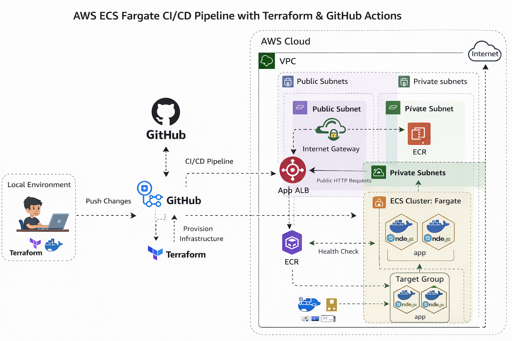

# AWS ECS Fargate CI/CD Pipeline with Terraform & GitHub Actions

## Overview
This project demonstrates a production-style CI/CD pipeline for a Dockerized Node.js application on AWS using Terraform and GitHub Actions.

The project automates:
- infrastructure provisioning using Terraform
- Docker image build and push to Amazon ECR
- ECS task definition update and deployment
- application delivery through Amazon ECS Fargate behind an Application Load Balancer

## Tech Stack
- AWS
  - Amazon ECS Fargate
  - Amazon ECR
  - Application Load Balancer
  - VPC
  - Public and Private Subnets
  - NAT Gateway
  - Security Groups
  - CloudWatch Logs
- Terraform
- GitHub Actions
- Docker
- Node.js
- Express.js

## Architecture



The application is deployed on ECS Fargate inside private subnets.
An internet-facing Application Load Balancer receives traffic and forwards requests to healthy ECS tasks.
Docker images are stored in Amazon ECR.
GitHub Actions automates build and deployment on every push to the main branch.

## CI/CD Workflow
1. Developer pushes code to GitHub
2. GitHub Actions workflow starts automatically
3. Docker image is built from the application source
4. Image is pushed to Amazon ECR
5. ECS task definition is updated with the new image
6. ECS service deploys the updated task definition
7. ALB routes traffic to healthy ECS tasks

## Features
- Infrastructure as Code using Terraform
- Automated deployment with GitHub Actions
- Dockerized Node.js application
- Secure deployment using private subnets
- Load balancing with health checks
- Container image versioning through ECR
- Production-style AWS architecture

## Project Structure
```text
.
├── .github/workflows/
├── app/
├── terraform/
├── task-definition.json
└── README.md