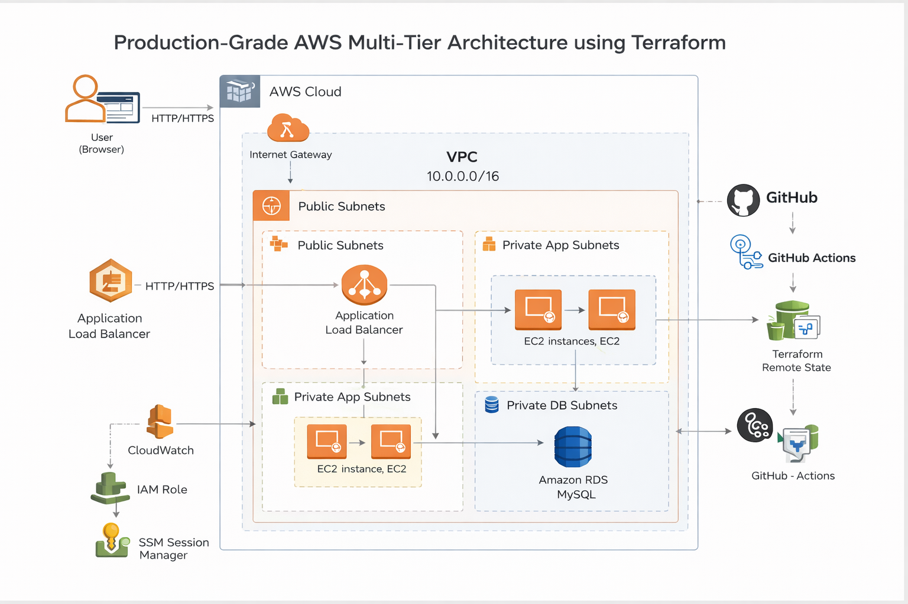

🚀 Multi-Tier AWS Architecture using Terraform (Advanced)
📌 Overview

This project demonstrates a production-style 3-tier architecture on AWS provisioned using Terraform with modular design and DevOps best practices.

It includes:

Scalable infrastructure
Secure networking
Infrastructure as Code (IaC)
CI/CD integration using GitHub Actions
Monitoring and automation

🏗️ Architecture

This project follows a 3-tier architecture:

Web Tier (ALB) → Public access
Application Tier (EC2 in Auto Scaling Group) → Private
Database Tier (RDS MySQL) → Private & secured

🧱 Tech Stack

Terraform (Infrastructure as Code)
AWS Services:
VPC
EC2
Auto Scaling Group
Application Load Balancer (ALB)
RDS (MySQL)
IAM
SSM (Session Manager)
CloudWatch
S3 (Remote Backend)
GitHub Actions (CI/CD)

⚙️ Features

✅ Infrastructure

Custom VPC with:
Public Subnets
Private App Subnets
Private DB Subnets
Internet Gateway + NAT Gateway
Route Tables configured properly

✅ Compute Layer

EC2 instances in private subnet
Auto Scaling Group for high availability
Launch Template with user data

✅ Load Balancer

Application Load Balancer (ALB)
Target Group with health checks
Traffic routing to app instances

✅ Database Layer

RDS MySQL in private subnet
Secure access via Security Groups

✅ Security (Very Important)

No public access to EC2
No SSH — uses SSM Session Manager
Security Groups restrict:
ALB → EC2
EC2 → RDS
IAM Roles instead of hardcoded credentials

✅ Monitoring & Scaling

CloudWatch Alarms
Auto Scaling policies based on CPU

✅ Terraform Best Practices

Modular architecture:
vpc
security
alb
asg
rds
iam
monitoring
Remote backend using S3
Variables and outputs structured properly

✅ CI/CD Integration

GitHub Actions pipeline:
terraform init
terraform fmt
terraform validate
terraform plan
Uses GitHub Secrets for sensitive values

🔐 Security Best Practices Implemented
No hardcoded credentials
IAM roles used for EC2 access
SSM used instead of SSH
Database isolated in private subnet
Least privilege access design

🔁 CI/CD Workflow

GitHub Actions automates:

Terraform validation
Code formatting checks
Infrastructure planning

Secrets are securely managed using GitHub Secrets.

📈 Future Enhancements

HTTPS with ACM + Route53
Flask/Docker-based application deployment
Secrets Manager integration
Blue/Green deployment
Kubernetes (EKS) integration

🚀 How to Deploy

1️⃣ Clone the repo
git clone https://github.com/roshan53/Terraform-Projects.git

cd multi-tier-architecture-using-terraform-v2

2️⃣ Initialize Terraform
terraform init

3️⃣ Validate
terraform validate

4️⃣ Plan
terraform plan

5️⃣ Apply
terraform apply

👨‍💻 Author

Roshan K
Cloud Engineer | AWS Certified | Terraform Associate
